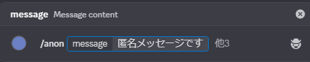
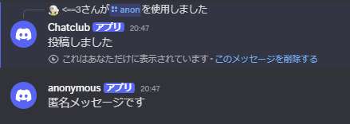
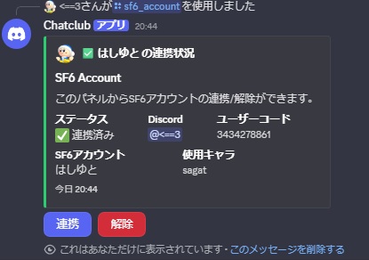
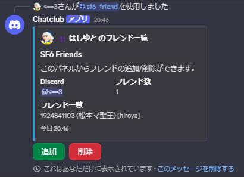
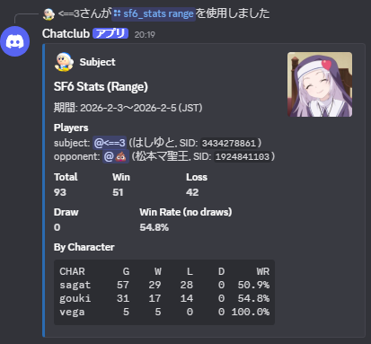
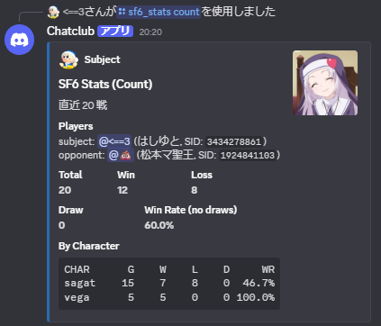
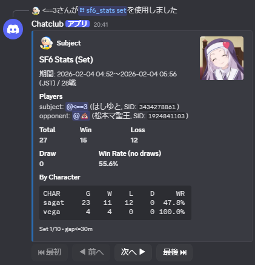
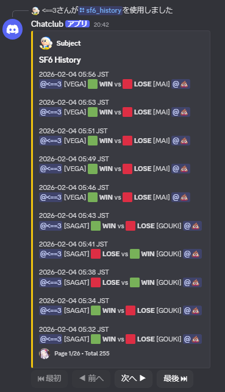

# Chatclub

**Chatclub** は、Street Fighter 6（Buckler）のカスタム対戦ログを取得・集計し、  
Discord Bot から戦績・履歴・セッションを見える化するためのバックエンドである。

---

## ⚙️ 技術スタック

| 項目 | 使用技術 |
|------|-----------|
| 言語 | Go 1.25.1 |
| Web Framework | Echo v4 |
| DB | PostgreSQL 16 |
| Migration | Atlas |
| Container | Docker / docker-compose |
| Discord連携 | [discordgo](https://github.com/bwmarrin/discordgo) |


## 🎥 Demo

- 動画URL（準備中）

## 📌 招待URL

Discord Bot をサーバへ招待する URL をここに置く。  
（`<APP_ID>` を自分の Application ID に置き換える）

```
https://discord.com/oauth2/authorize?client_id=1461387682172375286&permissions=540142592&integration_type=0&scope=bot+applications.commands
```

## 🧭 セットアップ

セットアップ手順は docs に移動。

- `docs/setup.md`

## 🧩 コマンド一覧（できること）

### 基本
- `/ping` : Bot の生存確認。
- `/anon` : 匿名メッセージ投稿（本文・画像添付対応）。


- `/anon-channel add/remove` : 匿名チャンネルの登録・解除。

### SF6（Buckler）
※ SF6系コマンドは Street Fighter 6 のアカウント連携が必要。  
未連携の場合は使用できない。  
Buckler: https://www.streetfighter.com/6/buckler/ja-jp

- `/sf6_account` : 連携状況の表示・連携/解除ボタンの提示。自身の Street Fighter 6 アカウントを連携・解除できる。

- `/sf6_friend` : フレンド一覧と追加/削除。フレンドの Street Fighter 6 アカウントを連携できる。

- `/sf6_fetch` : 対戦ログの手動取得（管理者/許可ユーザー）。
- `/sf6_stats range` : 期間指定の戦績集計（JST）。

- `/sf6_stats count` : 直近N戦の勝率などを集計(画像は20戦)。

- `/sf6_stats set` : 連戦を1セットとして勝率などを集計（30分以内の試合間隔を同一セット扱い）。一番直近の連戦から過去の連戦まで確認できる。

- `/sf6_history` : 対戦履歴の一覧表示（ページング）。

- `/sf6_session start/end` : セッション開始/終了と集計。
